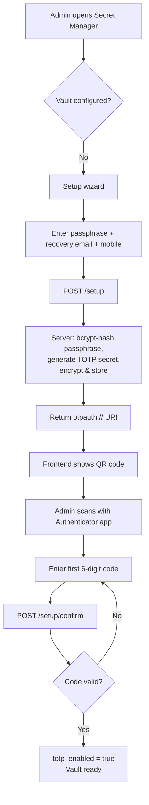
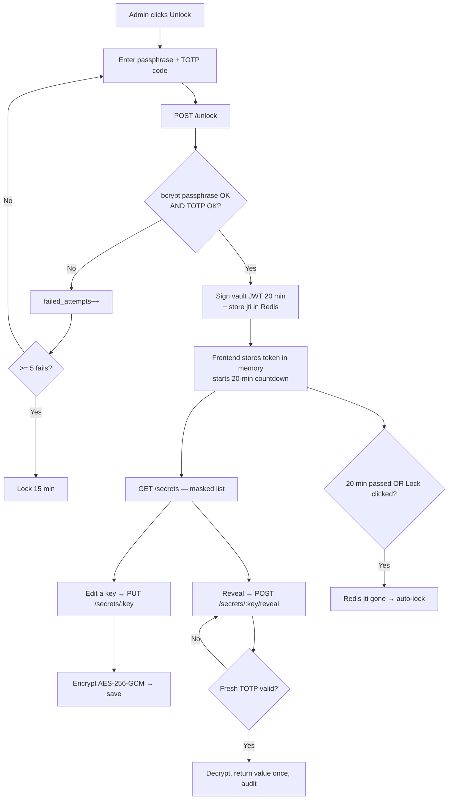

# Admin Secret Manager — Technical Guide

> A locked, encrypted vault inside the admin panel where a customer's super-admin
> can store and manage their own third-party integration keys (Stripe, Twilio, Google
> login, Zoom, Firebase, etc.) — without touching `.env` files or a server.

This document explains **how it works under the hood**: the libraries, the algorithms,
the data flow, and the security decisions. Written technical but in plain English.

---

## 1. Why this exists

The product is sold to many customers in many countries. The **code is identical** for
everyone — only the **credentials differ** (each customer has their own Stripe account,
their own Twilio number, their own Google OAuth app).

Customers are **not technical**. We don't want them editing environment files on a server.
So we give them a screen: **Account Settings → Secret Manager**. They type their keys there,
we store them safely, encrypted, in the database.

---

## 2. The two-tier rule (the most important idea)

Not every key is allowed in this tab. Keys are split into two tiers:

| Tier | Examples | Where it lives | In this tab? |
|------|----------|----------------|--------------|
| **Tier-1** (infra / bootstrap) | `DATABASE_URL`, `REDIS_URL`, `JWT_SECRET`, `AWS_ACCESS_KEY_ID`, `SECRETS_MASTER_KEY`, `*_SERVICE_URL` | Deploy env only | ❌ **Never** |
| **Tier-2** (integrations) | `STRIPE_SECRET_KEY`, `TWILIO_AUTH_TOKEN`, `GOOGLE_CLIENT_SECRET`, `ZOOM_CLIENT_SECRET`, `FIREBASE_PRIVATE_KEY` | Encrypted in DB, managed here | ✅ Yes |

**Why the split?** Tier-1 keys are needed *before* the app can even connect to a database —
you can't store the DB password *inside* the DB. And if one leaks, the whole system is
compromised. Tier-2 keys are per-integration; a leak is bad but contained.

The allowlist is hard-coded in `secret-catalog.ts`. **Only keys in that list can ever be
written.** Anything else is rejected. This is not a UI restriction — it's enforced in the
service layer.

---

## 3. Tech stack used

| Concern | Tool / Method | File |
|---------|---------------|------|
| Encryption at rest | **AES-256-GCM** (Node built-in `crypto`) | `packages/common/src/utils/secret-crypto.util.ts` |
| Key derivation | **scrypt** (Node `crypto.scryptSync`) | same |
| Passphrase hashing | **bcrypt** (cost 12) | `vault.service.ts` |
| Second factor | **TOTP / RFC 6238**, hand-written with Node `crypto` (no `otplib`) | `packages/common/src/utils/totp.util.ts` |
| Vault session token | **JWT** (`@nestjs/jwt`) + **Redis** (`ioredis`) session record | `vault.service.ts` |
| Rate-limit / lockout | Counter columns in DB + Redis | `vault.service.ts` |
| Recovery delivery | **AWS SES** (email) + **SQS → notification-service** (SMS) | `vault.service.ts` |
| Storage | **PostgreSQL** via **Drizzle ORM** | `packages/database/src/schema/admin.ts` |
| API framework | **NestJS 10** on **Fastify** | `apps/admin-service` |
| Access control | NestJS Guards (`AuthGuard('jwt')`, `RolesGuard`, custom `VaultGuard`) | `secret-manager.controller.ts`, `vault.guard.ts` |
| Frontend | **React 18 + Vite**, **Zustand** store (in-memory) | `apps/admin-panel-web` |

**No new npm dependencies were added.** TOTP and encryption both use Node's built-in
`crypto` module. This keeps the services lean and avoids pulling `otplib`/`qrcode` into
the backend (the frontend renders the QR from the `otpauth://` URI we return).

---

## 4. How encryption works (AES-256-GCM)

The core is `secret-crypto.util.ts`. Three functions: `encryptSecret`, `decryptSecret`, `maskValue`.

### The key

- Env var **`SECRETS_MASTER_KEY`** holds the master key (base64, recommended 32 bytes).
- The code does **not** use it directly. It runs it through **scrypt** with a fixed salt to
  derive the actual 32-byte AES key:
  ```js
  cachedKey = scryptSync(master, KDF_SALT, 32);
  ```
- The key is derived **once** and cached in memory. Loaded **lazily** — the app boots fine
  without it; it only fails when someone actually tries to encrypt/decrypt.
- Minimum length enforced: **16 chars** (`master.length < 16` → throws).

### Encrypting

```
plaintext  ─▶  AES-256-GCM(key, random 12-byte IV)  ─▶  ciphertext + auth tag
                                                        │
                       packed as one string ───────────┘
                       "v1.<ivBase64>.<tagBase64>.<ciphertextBase64>"
```

- **GCM** = "authenticated" encryption. It produces an **auth tag** — a tamper seal.
- Every value gets a **fresh random IV** (initialization vector), so encrypting the same
  key twice gives different ciphertext.
- Everything (version + IV + tag + ciphertext) is packed into **one text column** (`value_enc`).
- We also store `last_four` (last 4 chars of the plaintext) separately, for masked display.

### Decrypting

Split the packed string back into 4 parts, verify the auth tag. If the ciphertext was
tampered with (even one byte changed), `.final()` **throws** — "fail closed". No silent
corruption.

### Masking

`maskValue('4242')` → `••••4242`. The list view **only ever** shows this. Full values
never leave the DB except through the guarded `reveal` endpoint.

### Why encrypt (not hash)?

Tier-2 secrets must be **replayed** to Stripe/Twilio/etc. — so we need to get the original
value back → **reversible encryption**. Passphrases are only ever *compared*, never replayed
→ they are **hashed** with bcrypt (one-way).

---

## 5. How the second factor works (TOTP)

`totp.util.ts` is a minimal RFC 6238 implementation — the same standard Google
Authenticator, Authy, and 1Password use.

- **Secret**: 160 random bits, base32-encoded (`generateTotpSecret`).
- **Algorithm**: HMAC-SHA1, 30-second time step, 6 digits (the universal defaults).
- **Verify**: `verifyTotp(token, secret, window=1)` — checks the current code plus one step
  before and after, to tolerate clock drift.
- **Enrollment**: backend returns an `otpauth://totp/...` URI; the frontend renders it as a
  QR code for the user to scan.

The TOTP secret itself is **encrypted at rest** (with the same AES helper) before being
stored — so a DB dump doesn't leak the seed either.

> **Dev backdoor:** when `NODE_ENV !== 'production'`, the code `123456` is accepted as a
> valid TOTP so the flow is testable without an authenticator app. **This must be off in
> production/staging** (`vault.service.ts:108`).

---

## 6. Database schema

Two new tables in `packages/database/src/schema/admin.ts` (migration `0044_secret_manager.sql`).
Both are **additive** — no existing table is touched.

### `managed_secrets` — one row per stored key

| Column | Purpose |
|--------|---------|
| `key` (unique) | e.g. `STRIPE_SECRET_KEY` |
| `category` | payments / email / sms / oauth / video / push |
| `value_enc` | the packed AES-256-GCM ciphertext |
| `last_four` | last 4 chars, for masked display |
| `is_set` | has a value been saved? |
| `validation_status` | unknown / valid / invalid |
| `updated_by` → `admin_users` | who last changed it |

### `secret_manager_credentials` — one row per admin (their vault lock)

| Column | Purpose |
|--------|---------|
| `user_id` (unique) → `users` | vault owner |
| `passphrase_hash` | bcrypt hash of the unlock passphrase |
| `totp_secret_enc` | encrypted TOTP seed |
| `totp_enabled` | has the first code been confirmed? |
| `recovery_email`, `recovery_mobile` | for dual-channel reset |
| `failed_attempts`, `locked_until` | brute-force lockout |
| `last_unlock_at` | audit |

Audit trail reuses the existing `activity_logs` table (action, entityType, key — **never the
raw value**).

---

## 7. The security layers (defense in depth)

To do anything with a secret, a request must pass **all** of these:

```
1. AuthGuard('jwt')   → valid admin login (long-lived admin JWT)
2. RolesGuard         → role is 'admin' or 'super_admin'
3. VaultGuard         → a live, unexpired vault session (X-Vault-Token)
4. (reveal only)      → a FRESH TOTP code on top of everything above
```

The key insight: the **admin JWT alone is not enough**. Even a stolen admin token cannot
touch secrets — it needs a separate, short-lived **vault session** obtained by unlocking.

### The vault session

On successful unlock, `issueToken()`:
1. Signs a JWT with `{ sub, scope: 'secret-manager', jti }`, expiring in **20 minutes**.
2. Stores the `jti` in Redis: `vault:sess:{jti}` with a 1200-second TTL.

`VaultGuard` on every secret call checks: valid signature **AND** scope is `secret-manager`
**AND** `token.sub` matches the logged-in admin **AND** the `jti` still exists in Redis.

Two independent expiries → the session is both **time-limited** (JWT exp) and
**revocable** (delete the Redis key → instant lock, e.g. on "Lock" button).

### Brute-force protection

Wrong passphrase or TOTP → `failed_attempts++`. At **5 fails** → `locked_until` set to
**now + 15 minutes**. Locked account rejects unlock until the time passes.

---

## 8. Endpoints

All under the gateway path `/api/v1/secret-manager/*`. Gateway forwards to admin-service
and passes the `X-Vault-Token` header through.

| Method | Path | Guards | What it does |
|--------|------|--------|--------------|
| GET | `/status` | JWT + Roles | Is vault configured / TOTP on / locked? |
| POST | `/setup` | JWT + Roles | First-time: set passphrase + recovery + get TOTP QR |
| POST | `/setup/confirm` | JWT + Roles | Enter first TOTP code to enable vault |
| POST | `/unlock` | JWT + Roles | passphrase + TOTP → 20-min vault token |
| POST | `/lock` | JWT + Roles | Revoke the current vault session |
| POST | `/change-passphrase` | + **VaultGuard** | Change passphrase (needs unlocked + TOTP) |
| POST | `/recovery/request` | JWT + Roles | Send email + mobile OTP |
| POST | `/recovery/confirm` | JWT + Roles | Both OTPs + new passphrase → reset |
| GET | `/secrets` | + **VaultGuard** | Masked list, grouped by category |
| PUT | `/secrets/:key` | + **VaultGuard** | Encrypt + save one key |
| POST | `/secrets/:key/reveal` | + **VaultGuard** + **fresh TOTP** | Decrypt one value, return once |
| POST | `/secrets/:key/test` | + **VaultGuard** | Format-check a stored key |

---

## 9. Flow charts

### 9.1 First-time setup



### 9.2 Unlock + use (the daily flow)



### 9.3 Where the encryption key lives (data at rest)

```
┌──────────────────────────────┐         ┌─────────────────────────────────┐
│  Deploy environment (env)     │         │  PostgreSQL (managed_secrets)   │
│                               │         │                                 │
│  SECRETS_MASTER_KEY=kE6t...   │         │  key       = STRIPE_SECRET_KEY  │
│         │                     │         │  value_enc = v1.aX9.../gibberish│
│         │ scrypt              │         │  last_four = 4242               │
│         ▼                     │         └─────────────────────────────────┘
│  32-byte AES key (in memory)  │                    ▲
│         │                     │  encrypt / decrypt │
│         └────────────────────────────────────────-┘
└──────────────────────────────┘
   Key NEVER stored in DB. DB dump alone = useless gibberish.
```

### 9.4 Request path through the system

```
Browser (admin-panel-web)
   │  Authorization: Bearer <admin JWT>
   │  X-Vault-Token: <vault JWT>
   ▼
API Gateway (:3000)  ── validates admin JWT, forwards both headers ──▶
   ▼
admin-service (:3007)  /secret-manager/*
   ├─ AuthGuard('jwt')   → admin identity
   ├─ RolesGuard         → super_admin / admin
   ├─ VaultGuard         → verify vault JWT + Redis jti
   │                        │
   │                        ▼ Redis: vault:sess:{jti}
   └─ SecretManagerService → encrypt/decrypt via SECRETS_MASTER_KEY
                             │
                             ▼ PostgreSQL: managed_secrets
```

---

## 10. Recovery (forgot passphrase)

Deliberately hard — needs **two channels**:

1. `POST /recovery/request` → server generates two 6-digit OTPs, stores them in Redis
   (10-min TTL), sends one to the **recovery email** (via AWS SES) and one to the
   **recovery mobile** (via SQS → notification-service).
2. `POST /recovery/confirm` with **both** OTPs + a new passphrase. Both must match →
   passphrase reset, lockout cleared, owner emailed a "your passphrase was reset" notice.

> **Dev note:** when `NODE_ENV !== 'production'`, the OTPs are returned in the API response
> (and logged) so recovery is testable without live email/SMS. Off in production.
>
> **Phase-1 note:** the SMS consumer in notification-service may still need wiring before
> mobile OTP delivers in real production.

---

## 11. Frontend behavior (`apps/admin-panel-web`)

- **Vault store** (`stores/vaultStore.ts`): Zustand, **in-memory only, never persisted**.
  Holds the vault token + expiry. Refresh the page → vault is locked again. This is
  intentional — the token never touches localStorage.
- Every secret API call attaches `X-Vault-Token` from the store (`api/secretManager.ts`).
- 20-minute countdown banner; auto-locks on expiry.
- All key inputs are masked (`type=password`, autocomplete off). No secret is ever shown
  in a toast or stored in the browser.
- Nav item shows only for `super_admin` (route: `SECRET_MANAGER`).

---

## 12. What it does NOT do yet (scope boundary)

This is **Phase 1: store + protect**. The rest of the app **still reads its keys from
`.env`, not from this vault.** Payment/notification/auth services have not been wired to
read from `managed_secrets` yet.

**Phase 2** (future): a `SecretsConfigService` that reads decrypted values from the vault
with caching + invalidation, so services actually consume the stored keys. Also: real
network validation in `/test` (currently just format regex checks), and AWS KMS envelope
encryption as an optional upgrade over the app-level key.

---

## 13. Deployment checklist (per customer / environment)

1. Set a **unique, strong `SECRETS_MASTER_KEY`** (`openssl rand -base64 32`) in that
   environment's secret store. **Never reuse across deployments. Never change once secrets
   are stored** (stored secrets become unreadable).
2. Run migration `0044_secret_manager.sql` on that database.
3. Run `seed-rbac` so the `secrets:manage` permission exists.
4. Ensure `NODE_ENV=production` — this disables the `123456` TOTP backdoor and the
   OTP-in-response dev helper.
5. Confirm SES (email) and the SMS pipeline are configured for recovery to work.
```