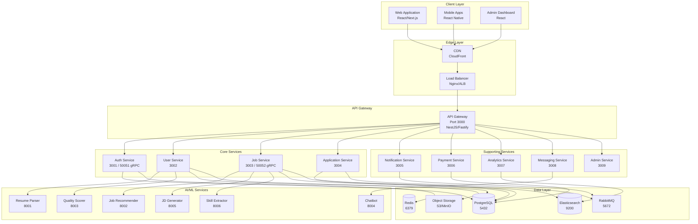
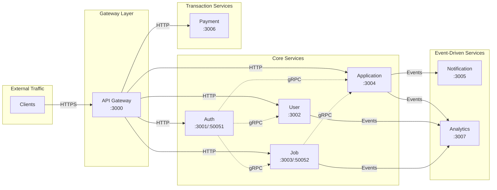
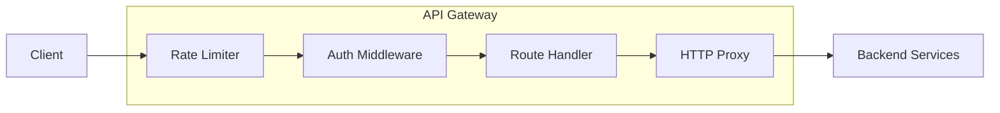
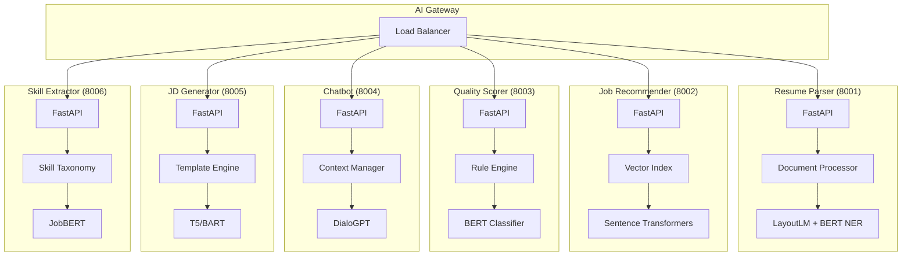
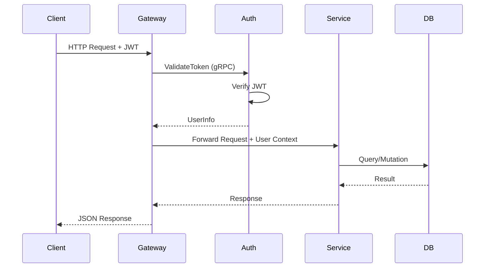
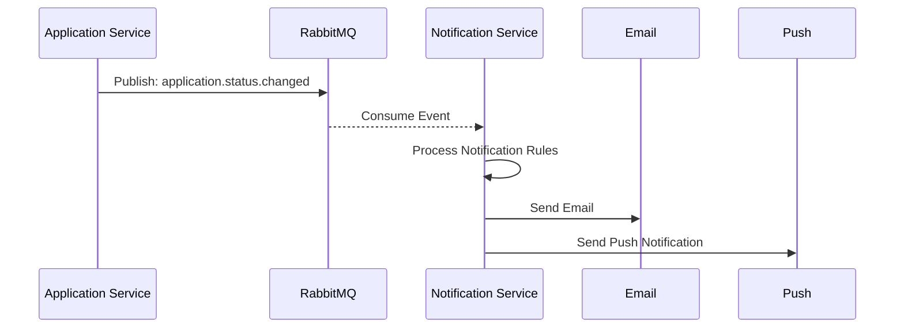
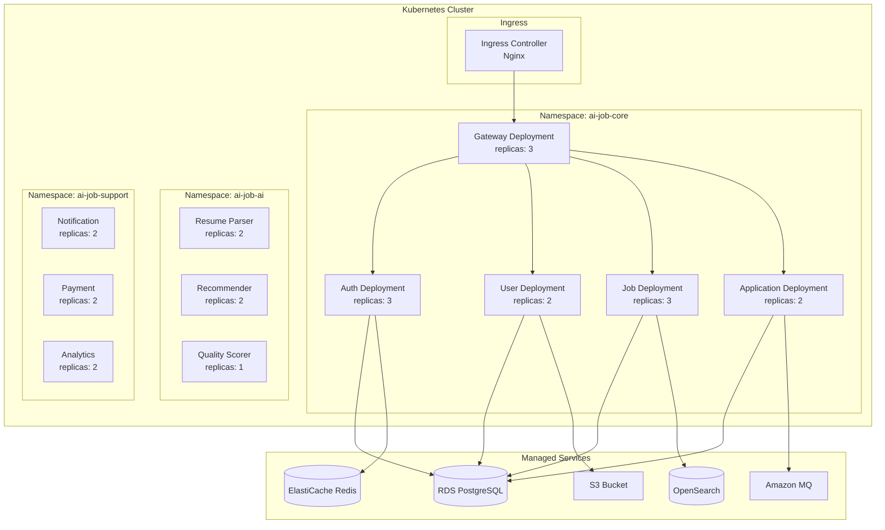
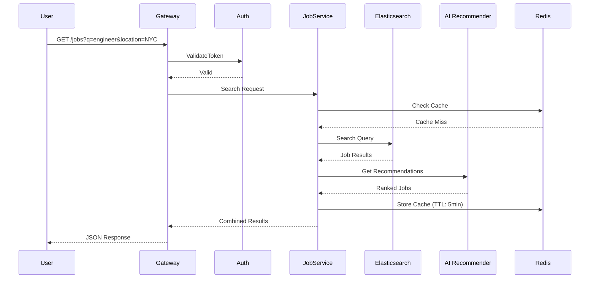
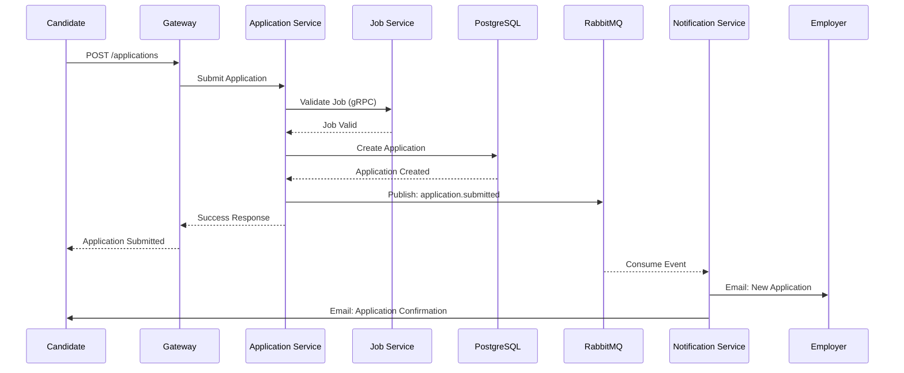
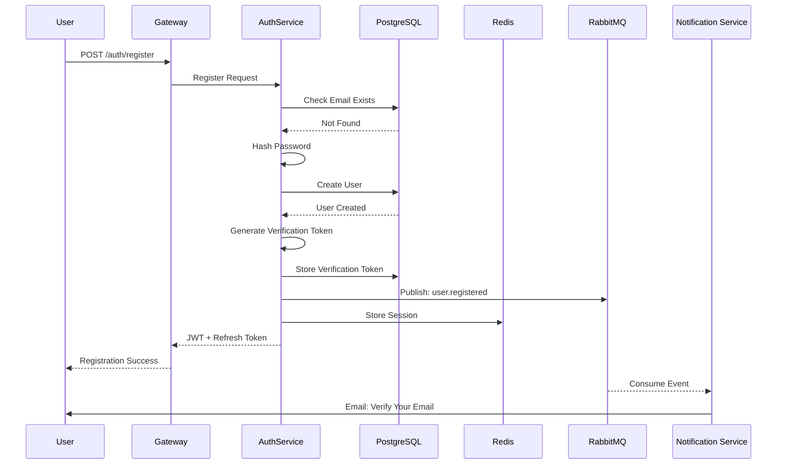

# Microservices Architecture

## Overview

| Property | Value |
|----------|-------|
| Architecture | Microservices |
| Communication | REST + gRPC |
| Message Queue | RabbitMQ |
| Cache | Redis |
| Search | Elasticsearch |
| Database | PostgreSQL |

## Table of Contents

1. [High-Level Architecture](#high-level-architecture)
2. [Service Topology](#service-topology)
3. [Node.js Services](#nodejs-services)
4. [Python AI Services](#python-ai-services)
5. [Communication Patterns](#communication-patterns)
6. [Infrastructure Components](#infrastructure-components)
7. [Deployment Architecture](#deployment-architecture)
8. [Data Flow Diagrams](#data-flow-diagrams)

---

## High-Level Architecture



---

## Service Topology



---

## Node.js Services

### Service Registry

| Service | HTTP Port | gRPC Port | Framework | Status |
|---------|-----------|-----------|-----------|--------|
| API Gateway | 3000 | - | NestJS/Fastify | Active |
| Auth Service | 3001 | 50051 | NestJS/Fastify | Active |
| User Service | 3002 | - | NestJS/Fastify | Active |
| Job Service | 3003 | 50052 | NestJS/Express | Active |
| Application Service | 3004 | - | NestJS/Express | Active |
| Notification Service | 3005 | - | NestJS | Planned |
| Payment Service | 3006 | - | NestJS | Planned |
| Analytics Service | 3007 | - | NestJS | Planned |
| Messaging Service | 3008 | - | NestJS | Planned |
| Admin Service | 3009 | - | NestJS | Planned |

### API Gateway (Port 3000)



**Responsibilities:**
- Request routing to microservices
- JWT validation via Auth Service
- Rate limiting (100 req/min default)
- Request/response logging
- Error handling & formatting

**Route Mappings:**

| Route Pattern | Target Service |
|---------------|----------------|
| `/api/v1/auth/*` | Auth Service (3001) |
| `/api/v1/profile/*` | User Service (3002) |
| `/api/v1/candidate/*` | User Service (3002) |
| `/api/v1/onboarding/*` | User Service (3002) |
| `/api/v1/experience/*` | User Service (3002) |
| `/api/v1/education/*` | User Service (3002) |
| `/api/v1/skills/*` | User Service (3002) |
| `/api/v1/certifications/*` | User Service (3002) |
| `/api/v1/resumes/*` | User Service (3002) |
| `/api/v1/preferences/*` | User Service (3002) |
| `/api/v1/documents/*` | User Service (3002) |
| `/api/v1/jobs/*` | Job Service (3003) |
| `/api/v1/company/*` | Job Service (3003) |
| `/api/v1/saved-searches/*` | Job Service (3003) |
| `/api/v1/applications/*` | Application Service (3004) |
| `/api/v1/status/*` | Application Service (3004) |
| `/api/v1/interviews/*` | Application Service (3004) |
| `/api/v1/employers/candidates/*` | Application Service (3004) |

---

### Auth Service (Port 3001 / gRPC 50051)

**Responsibilities:**
- User registration & login
- JWT token generation & refresh
- OAuth (Google, LinkedIn)
- OTP/2FA handling
- Password reset
- Email verification
- Session management

**gRPC Methods:**
```protobuf
service AuthService {
  rpc ValidateToken(TokenRequest) returns (UserInfo);
  rpc GetUserById(UserIdRequest) returns (User);
}
```

**Dependencies:**
- PostgreSQL (users, sessions, otps tables)
- Redis (session cache, rate limiting)
- External: Google OAuth, LinkedIn OAuth, SMS Gateway

---

### User Service (Port 3002)

**Responsibilities:**
- Profile CRUD operations
- Resume management & upload
- Work experience management
- Education records
- Skills & certifications
- Job preferences
- Document uploads
- Profile completeness tracking
- Onboarding flow

**Dependencies:**
- PostgreSQL (profiles, workExperiences, etc.)
- Object Storage (S3/MinIO for files)
- Auth Service (gRPC for token validation)
- AI Services (Resume Parser, Quality Scorer)

---

### Job Service (Port 3003 / gRPC 50052)

**Responsibilities:**
- Job posting CRUD
- Job categories management
- Skills management
- Job search (Elasticsearch)
- Saved jobs & searches
- Job recommendations
- Company profiles

**gRPC Methods:**
```protobuf
service JobService {
  rpc CreateJob(JobRequest) returns (Job);
  rpc FindOneJob(JobIdRequest) returns (Job);
  rpc FindAllJobs(SearchRequest) returns (JobList);
  rpc UpdateJob(JobUpdateRequest) returns (Job);
  rpc RemoveJob(JobIdRequest) returns (Empty);
  rpc SearchJobs(SearchCriteria) returns (JobList);
  rpc CreateCategory(CategoryRequest) returns (Category);
  rpc FindAllCategories(Empty) returns (CategoryList);
  rpc CreateSkill(SkillRequest) returns (Skill);
  rpc FindAllSkills(Empty) returns (SkillList);
}
```

**Dependencies:**
- PostgreSQL (jobs, jobCategories, etc.)
- Elasticsearch (job indexing & search)
- Auth Service (gRPC for token validation)
- AI Services (Job Recommender, JD Generator, Skill Extractor)

---

### Application Service (Port 3004)

**Responsibilities:**
- Job application submission
- Application status tracking
- Interview scheduling
- Applicant management for employers
- Application history audit
- Notes & tags on applicants

**Dependencies:**
- PostgreSQL (jobApplications, interviews, etc.)
- RabbitMQ (notification events)
- Job Service (gRPC for job details)
- Auth Service (gRPC for token validation)

---

## Python AI Services

### Service Registry

| Service | Port | ML Model | Framework | Status |
|---------|------|----------|-----------|--------|
| Resume Parser | 8001 | LayoutLM + BERT NER | FastAPI | Active |
| Job Recommender | 8002 | Sentence Transformers | FastAPI | Active |
| Quality Scorer | 8003 | BERT Classifier | FastAPI | Active |
| Chatbot | 8004 | DialoGPT | FastAPI | Planned |
| JD Generator | 8005 | T5/BART | FastAPI | Planned |
| Skill Extractor | 8006 | JobBERT | FastAPI | Planned |

### AI Service Architecture



### Resume Parser (Port 8001)

**Purpose:** Extract structured data from resume documents

**Input/Output:**
```json
// Request
{
  "file_url": "https://storage.../resume.pdf",
  "file_type": "pdf"
}

// Response
{
  "personal_info": {
    "name": "John Doe",
    "email": "john@example.com",
    "phone": "+1234567890"
  },
  "work_experience": [...],
  "education": [...],
  "skills": [...],
  "confidence_scores": {...}
}
```

---

### Job Recommender (Port 8002)

**Purpose:** Generate personalized job recommendations

**Input/Output:**
```json
// Request
{
  "user_id": "uuid",
  "profile": {
    "skills": [...],
    "experience": [...],
    "preferences": {...}
  },
  "top_k": 10
}

// Response
{
  "recommendations": [
    {
      "job_id": "uuid",
      "score": 0.95,
      "reasons": ["skill_match", "location_match"]
    }
  ]
}
```

---

### Quality Scorer (Port 8003)

**Purpose:** Score resume quality and ATS compatibility

**Input/Output:**
```json
// Request
{
  "resume_text": "...",
  "target_job_description": "optional"
}

// Response
{
  "quality_score": 85,
  "ats_score": 78,
  "breakdown": {
    "formatting": 90,
    "keywords": 75,
    "experience_clarity": 88,
    "skill_relevance": 82
  },
  "suggestions": [...]
}
```

---

## Communication Patterns

### Synchronous Communication



### Asynchronous Communication (Events)



### gRPC Communication

| Consumer | Provider | Method | Purpose |
|----------|----------|--------|---------|
| Gateway | Auth | ValidateToken | JWT validation |
| User Service | Auth | ValidateToken | Auth check |
| Job Service | Auth | ValidateToken | Auth check |
| Application Service | Auth | ValidateToken | Auth check |
| Application Service | Job | FindOneJob | Get job details |
| Gateway | Auth | GetUserById | User lookup |

---

## Infrastructure Components

### PostgreSQL (Port 5432)

**Configuration:**
- Version: 15+
- Connection pooling: PgBouncer recommended
- Replication: Read replicas for scaling

**Key Features Used:**
- JSONB for flexible schema fields
- UUID for primary keys
- Partial indexes for performance
- Full-text search for basic queries

---

### Redis (Port 6379)

**Use Cases:**

| Use Case | Key Pattern | TTL |
|----------|-------------|-----|
| Session storage | `session:{userId}` | 24h |
| JWT blacklist | `blacklist:{token}` | Token expiry |
| Rate limiting | `ratelimit:{ip}:{endpoint}` | 1min |
| Job cache | `cache:job:{jobId}` | 5min |
| Search cache | `cache:search:{hash}` | 10min |
| OTP storage | `otp:{email}` | 5min |

---

### Elasticsearch (Port 9200)

**Indices:**

| Index | Purpose | Refresh Interval |
|-------|---------|------------------|
| `jobs` | Job search & filtering | 1s |
| `profiles` | Candidate search (optional) | 5s |
| `analytics` | Event logs | 30s |

**Job Index Mapping:**
```json
{
  "mappings": {
    "properties": {
      "title": { "type": "text", "analyzer": "standard" },
      "description": { "type": "text", "analyzer": "standard" },
      "location": { "type": "keyword" },
      "city": { "type": "keyword" },
      "state": { "type": "keyword" },
      "jobType": { "type": "keyword" },
      "experienceLevel": { "type": "keyword" },
      "skills": { "type": "keyword" },
      "salaryMin": { "type": "integer" },
      "salaryMax": { "type": "integer" },
      "isActive": { "type": "boolean" },
      "createdAt": { "type": "date" }
    }
  }
}
```

---

### RabbitMQ (Port 5672)

**Exchanges:**

| Exchange | Type | Purpose |
|----------|------|---------|
| `notifications.topic` | topic | Notification routing |
| `analytics.direct` | direct | Analytics events |
| `jobs.fanout` | fanout | Job updates broadcast |

**Queues:**

| Queue | Exchange | Routing Key | Consumer |
|-------|----------|-------------|----------|
| `email.queue` | notifications.topic | notification.email.* | Notification Service |
| `sms.queue` | notifications.topic | notification.sms.* | Notification Service |
| `push.queue` | notifications.topic | notification.push.* | Notification Service |
| `whatsapp.queue` | notifications.topic | notification.whatsapp.* | Notification Service |
| `analytics.events` | analytics.direct | events | Analytics Service |

---

## Deployment Architecture

### Docker Compose (Development)

```yaml
version: '3.8'
services:
  # Infrastructure
  postgres:
    image: postgres:15
    ports: ["5432:5432"]

  redis:
    image: redis:7
    ports: ["6379:6379"]

  elasticsearch:
    image: elasticsearch:8.11.0
    ports: ["9200:9200"]

  rabbitmq:
    image: rabbitmq:3-management
    ports: ["5672:5672", "15672:15672"]

  # Core Services
  api-gateway:
    build: ./apps/api-gateway
    ports: ["3000:3000"]
    depends_on: [auth-service, user-service, job-service]

  auth-service:
    build: ./apps/auth-service
    ports: ["3001:3001", "50051:50051"]
    depends_on: [postgres, redis]

  user-service:
    build: ./apps/user-service
    ports: ["3002:3002"]
    depends_on: [postgres, auth-service]

  job-service:
    build: ./apps/job-service
    ports: ["3003:3003", "50052:50052"]
    depends_on: [postgres, elasticsearch, auth-service]

  application-service:
    build: ./apps/application-service
    ports: ["3004:3004"]
    depends_on: [postgres, rabbitmq, auth-service]
```

### Kubernetes (Production)



---

## Data Flow Diagrams

### Job Search Flow



### Application Submission Flow



### User Registration Flow



---

## External Integrations

### Payment Gateways

| Provider | Region | Features |
|----------|--------|----------|
| Razorpay | India | UPI, Cards, Netbanking, Wallets |
| Stripe | International | Cards, ACH, SEPA |

### Communication Services

| Service | Purpose | Provider |
|---------|---------|----------|
| Email | Transactional emails | SendGrid |
| SMS | OTP, Alerts | Twilio |
| WhatsApp | Business messages | WhatsApp Business API |
| Push | Mobile notifications | Firebase Cloud Messaging |

### OAuth Providers

| Provider | Scopes |
|----------|--------|
| Google | email, profile |
| LinkedIn | r_emailaddress, r_liteprofile |

---

## Environment Variables

### Core Configuration

| Variable | Description | Default |
|----------|-------------|---------|
| `DATABASE_URL` | PostgreSQL connection | - |
| `REDIS_URL` | Redis connection | `redis://localhost:6379` |
| `ELASTICSEARCH_URL` | ES connection | `http://localhost:9200` |
| `RABBITMQ_URL` | RabbitMQ connection | `amqp://localhost:5672` |

### Service URLs

| Variable | Description | Default |
|----------|-------------|---------|
| `AUTH_SERVICE_URL` | Auth service | `http://localhost:3001` |
| `USER_SERVICE_URL` | User service | `http://localhost:3002` |
| `JOB_SERVICE_URL` | Job service | `http://localhost:3003` |
| `APPLICATION_SERVICE_URL` | Application service | `http://localhost:3004` |

### Security

| Variable | Description |
|----------|-------------|
| `JWT_SECRET` | JWT signing secret |
| `JWT_EXPIRES_IN` | Token expiry (e.g., `1d`) |
| `REFRESH_TOKEN_SECRET` | Refresh token secret |
| `REFRESH_TOKEN_EXPIRES_IN` | Refresh expiry (e.g., `7d`) |
