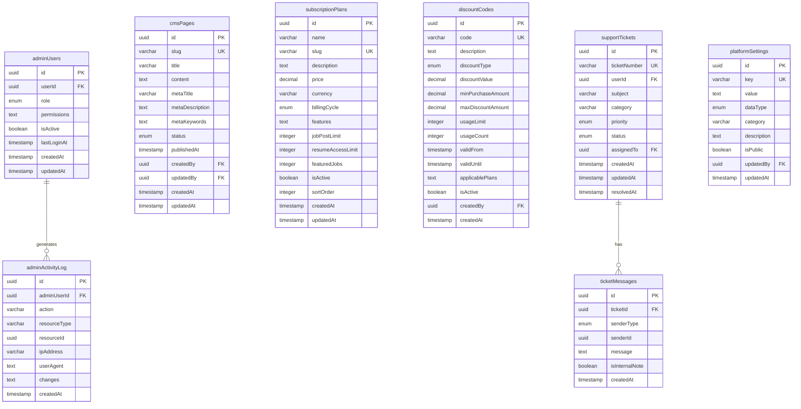

# Database Schema Documentation

## Overview

| Property | Value |
|----------|-------|
| Database | PostgreSQL 15+ |
| ORM | Drizzle ORM |
| Tables | 50+ |
| Domains | 10 |

## Table of Contents

1. [Master ER Diagram](#master-er-diagram)
2. [Domain 1: User Authentication](#domain-1-user-authentication)
3. [Domain 2: Job Seeker Profiles](#domain-2-job-seeker-profiles)
4. [Domain 3: Employer & Company](#domain-3-employer--company)
5. [Domain 4: Job Posting](#domain-4-job-posting)
6. [Domain 5: Applications](#domain-5-applications)
7. [Domain 6: Notifications](#domain-6-notifications)
8. [Domain 7: Payments](#domain-7-payments)
9. [Domain 8: Admin](#domain-8-admin)
10. [Domain 9: Analytics & Branding](#domain-9-analytics--branding)
11. [Domain 10: AI/ML](#domain-10-aiml)
12. [Enums Reference](#enums-reference)
13. [Indexes & Constraints](#indexes--constraints)

---

## Master ER Diagram


---

## Domain 1: User Authentication

### ER Diagram



```mermaid
erDiagram
    users {
        uuid id PK
        varchar firstName
        varchar lastName
        varchar email UK
        varchar password
        varchar mobile
        enum role
        boolean isVerified
        boolean isMobileVerified
        boolean isActive
        varchar twoFactorSecret
        boolean twoFactorEnabled
        timestamp lastLoginAt
        jsonb resumeDetails
        integer onboardingStep
        boolean isOnboardingCompleted
        timestamp createdAt
        timestamp updatedAt
    }

    socialLogins {
        uuid id PK
        uuid userId FK
        enum provider
        varchar providerUserId
        text accessToken
        text refreshToken
        timestamp tokenExpiresAt
        timestamp createdAt
    }

    sessions {
        uuid id PK
        uuid userId FK
        varchar token UK
        varchar refreshToken UK
        varchar ipAddress
        text userAgent
        text deviceInfo
        timestamp expiresAt
        timestamp createdAt
    }

    passwordResets {
        uuid id PK
        uuid userId FK
        varchar token UK
        timestamp expiresAt
        timestamp createdAt
    }

    emailVerifications {
        uuid id PK
        uuid userId FK
        varchar token UK
        timestamp expiresAt
        timestamp verifiedAt
        timestamp createdAt
    }

    otps {
        uuid id PK
        varchar email
        varchar otpHash
        timestamp expiresAt
        boolean isUsed
        timestamp createdAt
        timestamp usedAt
    }

    users ||--o{ socialLogins : has
    users ||--o{ sessions : has
    users ||--o{ passwordResets : requests
    users ||--o{ emailVerifications : has
```

### Table: users

| Column | Type | Constraints | Description |
|--------|------|-------------|-------------|
| id | UUID | PK | Primary key |
| firstName | VARCHAR(100) | | First name |
| lastName | VARCHAR(100) | | Last name |
| email | VARCHAR(255) | UNIQUE, NOT NULL | Email address |
| password | VARCHAR(255) | | Bcrypt hashed password |
| mobile | VARCHAR(20) | | Phone number |
| role | ENUM | NOT NULL | candidate, employer, admin, team_member |
| isVerified | BOOLEAN | DEFAULT false | Email verified |
| isMobileVerified | BOOLEAN | DEFAULT false | Mobile verified |
| isActive | BOOLEAN | DEFAULT true | Account active |
| twoFactorSecret | VARCHAR(255) | | 2FA secret |
| twoFactorEnabled | BOOLEAN | DEFAULT false | 2FA enabled |
| lastLoginAt | TIMESTAMP | | Last login time |
| resumeDetails | JSONB | | Parsed resume data |
| onboardingStep | INTEGER | DEFAULT 0 | Onboarding progress |
| isOnboardingCompleted | BOOLEAN | DEFAULT false | Onboarding complete |
| createdAt | TIMESTAMP | NOT NULL | Created time |
| updatedAt | TIMESTAMP | NOT NULL | Updated time |

### Table: socialLogins

| Column | Type | Constraints | Description |
|--------|------|-------------|-------------|
| id | UUID | PK | Primary key |
| userId | UUID | FK -> users (CASCADE) | User reference |
| provider | ENUM | NOT NULL | google, linkedin |
| providerUserId | VARCHAR(255) | NOT NULL | OAuth provider ID |
| accessToken | TEXT | | OAuth access token |
| refreshToken | TEXT | | OAuth refresh token |
| tokenExpiresAt | TIMESTAMP | | Token expiry |
| createdAt | TIMESTAMP | NOT NULL | Created time |

### Table: sessions

| Column | Type | Constraints | Description |
|--------|------|-------------|-------------|
| id | UUID | PK | Primary key |
| userId | UUID | FK -> users (CASCADE) | User reference |
| token | VARCHAR(500) | UNIQUE | JWT token |
| refreshToken | VARCHAR(500) | UNIQUE | Refresh token |
| ipAddress | VARCHAR(45) | | Client IP |
| userAgent | TEXT | | Browser/device info |
| deviceInfo | TEXT | | JSON device details |
| expiresAt | TIMESTAMP | NOT NULL | Session expiry |
| createdAt | TIMESTAMP | NOT NULL | Created time |

### Table: passwordResets

| Column | Type | Constraints | Description |
|--------|------|-------------|-------------|
| id | UUID | PK | Primary key |
| userId | UUID | FK -> users (CASCADE) | User reference |
| token | VARCHAR(255) | UNIQUE | Reset token |
| expiresAt | TIMESTAMP | NOT NULL | Token expiry |
| createdAt | TIMESTAMP | NOT NULL | Created time |

### Table: emailVerifications

| Column | Type | Constraints | Description |
|--------|------|-------------|-------------|
| id | UUID | PK | Primary key |
| userId | UUID | FK -> users (CASCADE) | User reference |
| token | VARCHAR(255) | UNIQUE | Verification token |
| expiresAt | TIMESTAMP | NOT NULL | Token expiry |
| verifiedAt | TIMESTAMP | | Verification time |
| createdAt | TIMESTAMP | NOT NULL | Created time |

### Table: otps

| Column | Type | Constraints | Description |
|--------|------|-------------|-------------|
| id | UUID | PK | Primary key |
| email | VARCHAR(255) | NOT NULL | Target email |
| otpHash | VARCHAR(255) | NOT NULL | Hashed OTP |
| expiresAt | TIMESTAMP | NOT NULL | OTP expiry |
| isUsed | BOOLEAN | DEFAULT false | Used flag |
| createdAt | TIMESTAMP | NOT NULL | Created time |
| usedAt | TIMESTAMP | | Usage time |

---

## Domain 2: Job Seeker Profiles

### ER Diagram

```mermaid
erDiagram
    profiles {
        uuid id PK
        uuid userId FK UK
        varchar firstName
        varchar middleName
        varchar lastName
        date dateOfBirth
        enum gender
        varchar phone
        varchar email
        varchar alternatePhone
        varchar addressLine1
        varchar addressLine2
        varchar city
        varchar state
        varchar country
        varchar pinCode
        varchar profilePhoto
        text professionalSummary
        decimal totalExperienceYears
        enum visibility
        boolean isProfileComplete
        integer completionPercentage
        timestamp createdAt
        timestamp updatedAt
    }

    workExperiences {
        uuid id PK
        uuid profileId FK
        varchar companyName
        varchar jobTitle
        varchar designation
        enum employmentType
        varchar location
        boolean isCurrent
        varchar duration
        boolean isFresher
        date startDate
        date endDate
        text description
        text achievements
        text skillsUsed
        integer displayOrder
        timestamp createdAt
        timestamp updatedAt
    }

    educationRecords {
        uuid id PK
        uuid profileId FK
        enum level
        varchar institution
        varchar degree
        varchar fieldOfStudy
        date startDate
        date endDate
        varchar grade
        text honors
        text relevantCoursework
        boolean currentlyStudying
        varchar certificateUrl
        text description
        text notes
        integer displayOrder
        timestamp createdAt
        timestamp updatedAt
    }

    skills {
        uuid id PK
        varchar name UK
        enum category
        boolean isActive
        timestamp createdAt
    }

    profileSkills {
        uuid id PK
        uuid profileId FK
        uuid skillId FK
        enum proficiencyLevel
        decimal yearsOfExperience
        integer displayOrder
        timestamp createdAt
    }

    certifications {
        uuid id PK
        uuid profileId FK
        varchar name
        varchar issuingOrganization
        date issueDate
        date expiryDate
        varchar credentialId
        varchar credentialUrl
        varchar certificateFile
        boolean isVerified
        timestamp createdAt
        timestamp updatedAt
    }

    resumes {
        uuid id PK
        uuid profileId FK
        varchar fileName
        varchar filePath
        integer fileSize
        enum fileType
        varchar resumeName
        boolean isDefault
        boolean isBuiltWithBuilder
        uuid templateId
        text parsedContent
        timestamp createdAt
        timestamp updatedAt
    }

    jobPreferences {
        uuid id PK
        uuid profileId FK UK
        text jobTypes
        text preferredLocations
        boolean willingToRelocate
        decimal expectedSalaryMin
        decimal expectedSalaryMax
        varchar salaryCurrency
        decimal expectedSalary
        enum noticePeriod
        text preferredIndustries
        enum workShift
        enum jobSearchStatus
        timestamp createdAt
        timestamp updatedAt
    }

    profileDocuments {
        uuid id PK
        uuid profileId FK
        enum documentType
        varchar fileName
        varchar filePath
        integer fileSize
        timestamp uploadedAt
    }

    profileViews {
        uuid id PK
        uuid profileId FK
        uuid employerId FK
        timestamp viewedAt
        varchar source
    }

    profiles ||--o{ workExperiences : has
    profiles ||--o{ educationRecords : has
    profiles ||--o{ profileSkills : has
    profiles ||--o{ certifications : has
    profiles ||--o{ resumes : has
    profiles ||--o| jobPreferences : has
    profiles ||--o{ profileDocuments : has
    profiles ||--o{ profileViews : receives
    skills ||--o{ profileSkills : "mapped via"
```

### Table: profiles

| Column | Type | Constraints | Description |
|--------|------|-------------|-------------|
| id | UUID | PK | Primary key |
| userId | UUID | FK -> users (CASCADE), UNIQUE | User reference |
| firstName | VARCHAR(100) | | First name |
| middleName | VARCHAR(100) | | Middle name |
| lastName | VARCHAR(100) | | Last name |
| dateOfBirth | DATE | | Birth date |
| gender | ENUM | | male, female, other, not_specified |
| phone | VARCHAR(20) | | Phone number |
| email | VARCHAR(255) | | Email |
| alternatePhone | VARCHAR(20) | | Alternate phone |
| addressLine1 | VARCHAR(255) | | Address line 1 |
| addressLine2 | VARCHAR(255) | | Address line 2 |
| city | VARCHAR(100) | | City |
| state | VARCHAR(100) | | State |
| country | VARCHAR(100) | | Country |
| pinCode | VARCHAR(20) | | PIN/ZIP code |
| profilePhoto | VARCHAR(500) | | Photo URL |
| professionalSummary | TEXT | | Bio/summary |
| totalExperienceYears | DECIMAL(4,2) | | Total experience |
| visibility | ENUM | DEFAULT public | public, private, semi_private |
| isProfileComplete | BOOLEAN | DEFAULT false | Completion flag |
| completionPercentage | INTEGER | DEFAULT 0 | Completion % |
| createdAt | TIMESTAMP | NOT NULL | Created time |
| updatedAt | TIMESTAMP | NOT NULL | Updated time |

### Table: workExperiences

| Column | Type | Constraints | Description |
|--------|------|-------------|-------------|
| id | UUID | PK | Primary key |
| profileId | UUID | FK -> profiles (CASCADE) | Profile reference |
| companyName | VARCHAR(255) | NOT NULL | Company name |
| jobTitle | VARCHAR(255) | NOT NULL | Job title |
| designation | VARCHAR(255) | | Designation |
| employmentType | ENUM | | full_time, part_time, contract, internship, freelance |
| location | VARCHAR(255) | | Work location |
| isCurrent | BOOLEAN | DEFAULT false | Current job flag |
| duration | VARCHAR(100) | | Duration string |
| isFresher | BOOLEAN | DEFAULT false | Fresher flag |
| startDate | DATE | | Start date |
| endDate | DATE | | End date |
| description | TEXT | | Job description |
| achievements | TEXT | | Achievements |
| skillsUsed | TEXT | | JSON skills array |
| displayOrder | INTEGER | DEFAULT 0 | Sort order |
| createdAt | TIMESTAMP | NOT NULL | Created time |
| updatedAt | TIMESTAMP | NOT NULL | Updated time |

### Table: educationRecords

| Column | Type | Constraints | Description |
|--------|------|-------------|-------------|
| id | UUID | PK | Primary key |
| profileId | UUID | FK -> profiles (CASCADE) | Profile reference |
| level | ENUM | | high_school, bachelors, masters, phd, diploma, certificate |
| institution | VARCHAR(255) | NOT NULL | Institution name |
| degree | VARCHAR(255) | | Degree name |
| fieldOfStudy | VARCHAR(255) | | Field/major |
| startDate | DATE | | Start date |
| endDate | DATE | | End date |
| grade | VARCHAR(50) | | Grade/GPA |
| honors | TEXT | | Honors/awards |
| relevantCoursework | TEXT | | Coursework |
| currentlyStudying | BOOLEAN | DEFAULT false | Currently enrolled |
| certificateUrl | VARCHAR(500) | | Certificate URL |
| description | TEXT | | Description |
| notes | TEXT | | Notes |
| displayOrder | INTEGER | DEFAULT 0 | Sort order |
| createdAt | TIMESTAMP | NOT NULL | Created time |
| updatedAt | TIMESTAMP | NOT NULL | Updated time |

### Table: skills

| Column | Type | Constraints | Description |
|--------|------|-------------|-------------|
| id | UUID | PK | Primary key |
| name | VARCHAR(100) | UNIQUE, NOT NULL | Skill name |
| category | ENUM | | technical, soft |
| isActive | BOOLEAN | DEFAULT true | Active flag |
| createdAt | TIMESTAMP | NOT NULL | Created time |

### Table: profileSkills

| Column | Type | Constraints | Description |
|--------|------|-------------|-------------|
| id | UUID | PK | Primary key |
| profileId | UUID | FK -> profiles (CASCADE) | Profile reference |
| skillId | UUID | FK -> skills (CASCADE) | Skill reference |
| proficiencyLevel | ENUM | | beginner, intermediate, advanced, expert |
| yearsOfExperience | DECIMAL(4,1) | | Years of exp |
| displayOrder | INTEGER | DEFAULT 0 | Sort order |
| createdAt | TIMESTAMP | NOT NULL | Created time |

### Table: certifications

| Column | Type | Constraints | Description |
|--------|------|-------------|-------------|
| id | UUID | PK | Primary key |
| profileId | UUID | FK -> profiles (CASCADE) | Profile reference |
| name | VARCHAR(255) | NOT NULL | Certification name |
| issuingOrganization | VARCHAR(255) | | Issuer |
| issueDate | DATE | | Issue date |
| expiryDate | DATE | | Expiry date |
| credentialId | VARCHAR(255) | | Credential ID |
| credentialUrl | VARCHAR(500) | | Verification URL |
| certificateFile | VARCHAR(500) | | File URL |
| isVerified | BOOLEAN | DEFAULT false | Verified flag |
| createdAt | TIMESTAMP | NOT NULL | Created time |
| updatedAt | TIMESTAMP | NOT NULL | Updated time |

### Table: resumes

| Column | Type | Constraints | Description |
|--------|------|-------------|-------------|
| id | UUID | PK | Primary key |
| profileId | UUID | FK -> profiles (CASCADE) | Profile reference |
| fileName | VARCHAR(255) | NOT NULL | File name |
| filePath | VARCHAR(500) | NOT NULL | Storage path |
| fileSize | INTEGER | | Size in bytes |
| fileType | ENUM | | pdf, doc, docx |
| resumeName | VARCHAR(255) | | Display name |
| isDefault | BOOLEAN | DEFAULT false | Default resume |
| isBuiltWithBuilder | BOOLEAN | DEFAULT false | Builder-created |
| templateId | UUID | | Template reference |
| parsedContent | TEXT | | Parsed text |
| createdAt | TIMESTAMP | NOT NULL | Created time |
| updatedAt | TIMESTAMP | NOT NULL | Updated time |

### Table: jobPreferences

| Column | Type | Constraints | Description |
|--------|------|-------------|-------------|
| id | UUID | PK | Primary key |
| profileId | UUID | FK -> profiles (CASCADE), UNIQUE | Profile reference |
| jobTypes | TEXT | | JSON array of job types |
| preferredLocations | TEXT | | JSON array of locations |
| willingToRelocate | BOOLEAN | DEFAULT false | Relocation flag |
| expectedSalaryMin | DECIMAL(10,2) | | Min salary |
| expectedSalaryMax | DECIMAL(10,2) | | Max salary |
| salaryCurrency | VARCHAR(10) | DEFAULT 'INR' | Currency |
| expectedSalary | DECIMAL(10,2) | | Expected salary |
| noticePeriod | ENUM | | immediate, 15_days, 1_month, 2_months, 3_months |
| preferredIndustries | TEXT | | JSON array |
| workShift | ENUM | | day, night, rotational, flexible |
| jobSearchStatus | ENUM | | actively_looking, open_to_opportunities, not_looking |
| createdAt | TIMESTAMP | NOT NULL | Created time |
| updatedAt | TIMESTAMP | NOT NULL | Updated time |

### Table: profileDocuments

| Column | Type | Constraints | Description |
|--------|------|-------------|-------------|
| id | UUID | PK | Primary key |
| profileId | UUID | FK -> profiles (CASCADE) | Profile reference |
| documentType | ENUM | NOT NULL | resume, cover_letter, certificate, id_proof, portfolio, other |
| fileName | VARCHAR(255) | NOT NULL | File name |
| filePath | VARCHAR(500) | NOT NULL | Storage path |
| fileSize | INTEGER | | Size in bytes |
| uploadedAt | TIMESTAMP | NOT NULL | Upload time |

### Table: profileViews

| Column | Type | Constraints | Description |
|--------|------|-------------|-------------|
| id | UUID | PK | Primary key |
| profileId | UUID | FK -> profiles (CASCADE) | Profile viewed |
| employerId | UUID | FK -> users (CASCADE) | Viewer |
| viewedAt | TIMESTAMP | NOT NULL | View time |
| source | VARCHAR(100) | | Traffic source |

---

## Domain 3: Employer & Company

### ER Diagram


### Table: employers

| Column | Type | Constraints | Description |
|--------|------|-------------|-------------|
| id | UUID | PK | Primary key |
| userId | UUID | FK -> users (CASCADE) | User reference |
| companyName | VARCHAR(255) | NOT NULL | Company name |
| companyId | UUID | FK -> companies (SET NULL) | Company reference |
| companyLogo | VARCHAR(500) | | Logo URL |
| website | VARCHAR(255) | | Website URL |
| industry | VARCHAR(100) | | Industry |
| companySize | VARCHAR(50) | | Size range |
| description | TEXT | | Description |
| isVerified | BOOLEAN | DEFAULT false | Verified flag |
| subscriptionPlan | ENUM | DEFAULT 'free' | free, basic, premium, enterprise |
| subscriptionExpiresAt | TIMESTAMP | | Plan expiry |
| createdAt | TIMESTAMP | NOT NULL | Created time |
| updatedAt | TIMESTAMP | NOT NULL | Updated time |

### Table: companies

| Column | Type | Constraints | Description |
|--------|------|-------------|-------------|
| id | UUID | PK | Primary key |
| userId | UUID | FK -> users (CASCADE) | Owner reference |
| name | VARCHAR(255) | NOT NULL | Company name |
| slug | VARCHAR(255) | UNIQUE | URL slug |
| industry | VARCHAR(100) | | Industry |
| companySize | ENUM | | 1-10, 11-50, 51-200, 201-500, 500+ |
| yearEstablished | INTEGER | | Founded year |
| companyType | ENUM | | startup, sme, mnc, government |
| website | VARCHAR(500) | | Website URL |
| description | TEXT | | Description |
| mission | TEXT | | Mission statement |
| culture | TEXT | | Culture description |
| benefits | TEXT | | JSON benefits array |
| logoUrl | VARCHAR(500) | | Logo URL |
| bannerUrl | VARCHAR(500) | | Banner URL |
| tagline | VARCHAR(255) | | Tagline |
| isVerified | BOOLEAN | DEFAULT false | Verified flag |
| verificationStatus | ENUM | DEFAULT 'pending' | pending, verified, rejected |
| verificationDocuments | TEXT | | JSON documents |
| createdAt | TIMESTAMP | NOT NULL | Created time |
| updatedAt | TIMESTAMP | NOT NULL | Updated time |

### Table: teamMembers

| Column | Type | Constraints | Description |
|--------|------|-------------|-------------|
| id | UUID | PK | Primary key |
| employerId | UUID | FK -> employers (CASCADE) | Employer reference |
| userId | UUID | FK -> users (CASCADE) | User reference |
| role | VARCHAR(50) | | Team role |
| permissions | TEXT[] | | Permission array |
| createdAt | TIMESTAMP | NOT NULL | Created time |
| updatedAt | TIMESTAMP | NOT NULL | Updated time |

---

## Domain 4: Job Posting

### ER Diagram


### Table: jobs

| Column | Type | Constraints | Description |
|--------|------|-------------|-------------|
| id | UUID | PK | Primary key |
| employerId | UUID | FK -> employers (CASCADE) | Employer reference |
| title | VARCHAR(255) | NOT NULL | Job title |
| description | TEXT | NOT NULL | Job description |
| jobType | VARCHAR(50) | | full_time, part_time, contract, gig, remote |
| workType | VARCHAR(50) | | Work arrangement |
| experienceLevel | VARCHAR(100) | | entry, mid, senior, lead |
| location | VARCHAR(255) | | Location string |
| city | VARCHAR(100) | | City |
| state | VARCHAR(100) | | State |
| salaryMin | INTEGER | | Minimum salary |
| salaryMax | INTEGER | | Maximum salary |
| payRate | VARCHAR(50) | | hourly, daily, monthly, yearly |
| showSalary | BOOLEAN | DEFAULT true | Show salary publicly |
| skills | TEXT[] | | Required skills array |
| categoryId | UUID | FK -> jobCategories (SET NULL) | Category reference |
| companyId | UUID | FK -> companies (SET NULL) | Company reference |
| trendingScore | INTEGER | | Trending metric |
| popularityScore | INTEGER | | Popularity metric |
| relevanceScore | INTEGER | | Relevance metric |
| lastActivityAt | TIMESTAMP | | Last activity |
| deadline | TIMESTAMP | | Application deadline |
| isActive | BOOLEAN | DEFAULT true | Active flag |
| isFeatured | BOOLEAN | DEFAULT false | Featured flag |
| isHighlighted | BOOLEAN | DEFAULT false | Highlighted flag |
| viewCount | INTEGER | DEFAULT 0 | View counter |
| applicationCount | INTEGER | DEFAULT 0 | Application counter |
| createdAt | TIMESTAMP | NOT NULL | Created time |
| updatedAt | TIMESTAMP | NOT NULL | Updated time |

**Indexes:**
- `idx_jobs_state_city` (state, city)
- `idx_jobs_job_type` (jobType)
- `idx_jobs_experience` (experienceLevel)
- `idx_jobs_is_active` (isActive)
- `uq_active_job_employer` UNIQUE PARTIAL (employerId, title, jobType, experienceLevel, city, state, workType) WHERE isActive=true

### Table: jobCategories

| Column | Type | Constraints | Description |
|--------|------|-------------|-------------|
| id | UUID | PK | Primary key |
| name | VARCHAR(100) | UNIQUE, NOT NULL | Category name |
| slug | VARCHAR(100) | UNIQUE | URL slug |
| description | TEXT | | Description |
| icon | VARCHAR(100) | | Icon identifier |
| isActive | BOOLEAN | DEFAULT true | Active flag |
| displayOrder | INTEGER | | Sort order |
| isDiscoverable | BOOLEAN | DEFAULT true | Discoverable flag |
| parentId | UUID | FK -> jobCategories (SET NULL) | Parent category |
| metadata | JSONB | | Additional metadata |
| createdAt | TIMESTAMP | NOT NULL | Created time |
| updatedAt | TIMESTAMP | NOT NULL | Updated time |

### Table: screeningQuestions

| Column | Type | Constraints | Description |
|--------|------|-------------|-------------|
| id | UUID | PK | Primary key |
| jobId | UUID | FK -> jobs (CASCADE) | Job reference |
| question | TEXT | NOT NULL | Question text |
| questionType | VARCHAR(20) | | text, single_choice, multiple_choice, yes_no, rating, date, file_upload |
| options | TEXT[] | | MCQ options array |
| isRequired | BOOLEAN | DEFAULT true | Required flag |
| order | INTEGER | DEFAULT 0 | Sort order |
| createdAt | TIMESTAMP | NOT NULL | Created time |

### Table: savedJobs

| Column | Type | Constraints | Description |
|--------|------|-------------|-------------|
| id | UUID | PK | Primary key |
| jobId | UUID | FK -> jobs (CASCADE) | Job reference |
| jobSeekerId | UUID | FK -> users (CASCADE) | User reference |
| createdAt | TIMESTAMP | NOT NULL | Created time |

**Constraints:**
- `uq_saved_job` UNIQUE (jobId, jobSeekerId)

### Table: jobViews

| Column | Type | Constraints | Description |
|--------|------|-------------|-------------|
| id | UUID | PK | Primary key |
| jobId | UUID | FK -> jobs (CASCADE) | Job reference |
| userId | UUID | FK -> users (CASCADE) | Viewer reference |
| viewedAt | TIMESTAMP | NOT NULL | View time |
| ipAddress | VARCHAR(45) | | Client IP |
| userAgent | TEXT | | Browser info |

**Indexes:**
- `idx_job_views_user_time` (userId, viewedAt)
- `idx_job_views_job` (jobId)

### Table: jobRecommendations

| Column | Type | Constraints | Description |
|--------|------|-------------|-------------|
| id | UUID | PK | Primary key |
| userId | UUID | FK -> users (CASCADE) | User reference |
| jobId | UUID | FK -> jobs (CASCADE) | Job reference |
| score | INTEGER | | Match score (0-100) |
| reason | TEXT | | Recommendation reason |
| createdAt | TIMESTAMP | NOT NULL | Created time |

**Indexes:**
- `idx_job_recommendations_user_score` (userId, score)

---

## Domain 5: Applications

### ER Diagram


### Table: jobApplications

| Column | Type | Constraints | Description |
|--------|------|-------------|-------------|
| id | UUID | PK | Primary key |
| jobId | UUID | FK -> jobs (CASCADE) | Job reference |
| jobSeekerId | UUID | FK -> users (CASCADE) | Applicant reference |
| status | ENUM | DEFAULT 'applied' | applied, viewed, shortlisted, interview_scheduled, rejected, hired, withdrawn, offer_accepted, offer_rejected |
| coverLetter | TEXT | | Cover letter |
| resumeUrl | VARCHAR(500) | | Resume URL |
| resumeSnapshot | JSONB | | Resume data at apply time |
| screeningAnswers | JSONB | | Screening responses |
| rating | INTEGER | | Employer rating |
| notes | TEXT | | Notes |
| statusHistory | JSONB | DEFAULT '[]' | Status change history |
| appliedAt | TIMESTAMP | NOT NULL | Application time |
| viewedAt | TIMESTAMP | | First view time |
| updatedAt | TIMESTAMP | NOT NULL | Updated time |

**Constraints:**
- `uq_job_seeker_application` UNIQUE (jobId, jobSeekerId)

### Table: interviews

| Column | Type | Constraints | Description |
|--------|------|-------------|-------------|
| id | UUID | PK | Primary key |
| applicationId | UUID | FK -> jobApplications (CASCADE) | Application reference |
| interviewType | VARCHAR(50) | | phone, video, in_person |
| scheduledAt | TIMESTAMP | NOT NULL | Interview time |
| duration | INTEGER | DEFAULT 60 | Duration in minutes |
| location | VARCHAR(255) | | Interview location |
| interviewerNotes | TEXT | | Interviewer notes |
| candidateFeedback | TEXT | | Candidate feedback |
| status | ENUM | DEFAULT 'scheduled' | scheduled, confirmed, completed, rescheduled, canceled, no_show |
| calendarEventId | VARCHAR(255) | | Calendar integration ID |
| reminderSent | TIMESTAMP | | Reminder sent time |
| createdAt | TIMESTAMP | NOT NULL | Created time |
| updatedAt | TIMESTAMP | NOT NULL | Updated time |

### Table: applicationHistory

| Column | Type | Constraints | Description |
|--------|------|-------------|-------------|
| id | UUID | PK | Primary key |
| applicationId | UUID | FK -> jobApplications (CASCADE) | Application reference |
| changedBy | UUID | | User who made change |
| previousStatus | ENUM | | Previous status |
| newStatus | ENUM | | New status |
| comment | TEXT | | Change comment |
| createdAt | TIMESTAMP | NOT NULL | Created time |

---

## Domain 6: Notifications

### ER Diagram


### Table: notifications

| Column | Type | Constraints | Description |
|--------|------|-------------|-------------|
| id | UUID | PK | Primary key |
| userId | UUID | FK -> users (CASCADE) | User reference |
| type | ENUM | NOT NULL | job_alert, application_update, interview, message, system |
| channel | ENUM | NOT NULL | email, sms, whatsapp, push |
| title | VARCHAR(255) | NOT NULL | Notification title |
| message | TEXT | NOT NULL | Notification body |
| metadata | TEXT | | JSON metadata |
| isRead | BOOLEAN | DEFAULT false | Read flag |
| readAt | TIMESTAMP | | Read time |
| createdAt | TIMESTAMP | NOT NULL | Created time |

### Table: notificationPreferences

| Column | Type | Constraints | Description |
|--------|------|-------------|-------------|
| id | UUID | PK | Primary key |
| userId | UUID | FK -> users (CASCADE) | User reference |
| jobAlerts | BOOLEAN | DEFAULT true | Job alerts enabled |
| applicationUpdates | BOOLEAN | DEFAULT true | Application updates |
| interviewReminders | BOOLEAN | DEFAULT true | Interview reminders |
| messages | BOOLEAN | DEFAULT true | Messages enabled |
| emailEnabled | BOOLEAN | DEFAULT true | Email channel |
| smsEnabled | BOOLEAN | DEFAULT false | SMS channel |
| whatsappEnabled | BOOLEAN | DEFAULT false | WhatsApp channel |
| pushEnabled | BOOLEAN | DEFAULT true | Push channel |
| createdAt | TIMESTAMP | NOT NULL | Created time |
| updatedAt | TIMESTAMP | NOT NULL | Updated time |

### Table: notificationLogs

| Column | Type | Constraints | Description |
|--------|------|-------------|-------------|
| id | UUID | PK | Primary key |
| userId | UUID | FK -> users (CASCADE) | User reference |
| notificationType | VARCHAR(50) | | Notification type |
| channel | ENUM | NOT NULL | email, push, sms, whatsapp |
| recipient | VARCHAR(255) | | Recipient address |
| subject | VARCHAR(255) | | Subject line |
| message | TEXT | | Message body |
| status | ENUM | DEFAULT 'pending' | pending, sent, delivered, failed, bounced |
| sentAt | TIMESTAMP | | Send time |
| deliveredAt | TIMESTAMP | | Delivery time |
| openedAt | TIMESTAMP | | Open time |
| clickedAt | TIMESTAMP | | Click time |
| errorMessage | TEXT | | Error details |
| metadata | TEXT | | JSON metadata |
| createdAt | TIMESTAMP | NOT NULL | Created time |

---

## Domain 7: Payments

### ER Diagram


### Table: payments

| Column | Type | Constraints | Description |
|--------|------|-------------|-------------|
| id | UUID | PK | Primary key |
| userId | UUID | FK -> users (CASCADE) | User reference |
| amount | DECIMAL(10,2) | NOT NULL | Payment amount |
| currency | VARCHAR(3) | DEFAULT 'INR' | Currency code |
| status | ENUM | DEFAULT 'pending' | pending, success, failed, refunded |
| paymentMethod | ENUM | | credit_card, debit_card, upi, netbanking, wallet |
| paymentGateway | VARCHAR(50) | | razorpay, stripe |
| transactionId | VARCHAR(255) | | Internal transaction ID |
| gatewayOrderId | VARCHAR(255) | | Gateway order ID |
| gatewayPaymentId | VARCHAR(255) | | Gateway payment ID |
| invoiceNumber | VARCHAR(50) | | Invoice number |
| invoiceUrl | VARCHAR(500) | | Invoice URL |
| metadata | TEXT | | JSON metadata |
| createdAt | TIMESTAMP | NOT NULL | Created time |
| updatedAt | TIMESTAMP | NOT NULL | Updated time |

### Table: subscriptions

| Column | Type | Constraints | Description |
|--------|------|-------------|-------------|
| id | UUID | PK | Primary key |
| employerId | UUID | FK -> employers (CASCADE) | Employer reference |
| plan | VARCHAR(50) | NOT NULL | free, basic, premium, enterprise |
| billingCycle | VARCHAR(20) | | monthly, quarterly, yearly |
| amount | DECIMAL(10,2) | | Plan amount |
| currency | VARCHAR(3) | DEFAULT 'INR' | Currency |
| startDate | TIMESTAMP | NOT NULL | Start date |
| endDate | TIMESTAMP | NOT NULL | End date |
| autoRenew | BOOLEAN | DEFAULT true | Auto-renewal flag |
| jobPostingLimit | INTEGER | DEFAULT 1 | Job post limit |
| jobPostingUsed | INTEGER | DEFAULT 0 | Jobs posted |
| featuredJobsLimit | INTEGER | DEFAULT 0 | Featured limit |
| featuredJobsUsed | INTEGER | DEFAULT 0 | Featured used |
| createdAt | TIMESTAMP | NOT NULL | Created time |
| updatedAt | TIMESTAMP | NOT NULL | Updated time |

---

## Domain 8: Admin

### ER Diagram



### Table: adminUsers

| Column | Type | Constraints | Description |
|--------|------|-------------|-------------|
| id | UUID | PK | Primary key |
| userId | UUID | FK -> users (CASCADE) | User reference |
| role | ENUM | NOT NULL | super_admin, admin, moderator, support |
| permissions | TEXT | | JSON permissions |
| isActive | BOOLEAN | DEFAULT true | Active flag |
| lastLoginAt | TIMESTAMP | | Last login |
| createdAt | TIMESTAMP | NOT NULL | Created time |
| updatedAt | TIMESTAMP | NOT NULL | Updated time |

### Table: subscriptionPlans

| Column | Type | Constraints | Description |
|--------|------|-------------|-------------|
| id | UUID | PK | Primary key |
| name | VARCHAR(100) | NOT NULL | Plan name |
| slug | VARCHAR(100) | UNIQUE | URL slug |
| description | TEXT | | Description |
| price | DECIMAL(10,2) | NOT NULL | Price |
| currency | VARCHAR(3) | DEFAULT 'INR' | Currency |
| billingCycle | ENUM | | one_time, monthly, quarterly, yearly |
| features | TEXT | | JSON features array |
| jobPostLimit | INTEGER | | Job post limit |
| resumeAccessLimit | INTEGER | | Resume access limit |
| featuredJobs | INTEGER | DEFAULT 0 | Featured job limit |
| isActive | BOOLEAN | DEFAULT true | Active flag |
| sortOrder | INTEGER | DEFAULT 0 | Sort order |
| createdAt | TIMESTAMP | NOT NULL | Created time |
| updatedAt | TIMESTAMP | NOT NULL | Updated time |

### Table: supportTickets

| Column | Type | Constraints | Description |
|--------|------|-------------|-------------|
| id | UUID | PK | Primary key |
| ticketNumber | VARCHAR(50) | UNIQUE | Ticket number |
| userId | UUID | FK -> users (CASCADE) | Submitter |
| subject | VARCHAR(255) | NOT NULL | Subject |
| category | VARCHAR(100) | | Category |
| priority | ENUM | DEFAULT 'medium' | low, medium, high, urgent |
| status | ENUM | DEFAULT 'open' | open, in_progress, resolved, closed |
| assignedTo | UUID | FK -> adminUsers | Assignee |
| createdAt | TIMESTAMP | NOT NULL | Created time |
| updatedAt | TIMESTAMP | NOT NULL | Updated time |
| resolvedAt | TIMESTAMP | | Resolution time |

---

## Domain 9: Analytics & Branding

### ER Diagram


### Table: companyPages

| Column | Type | Constraints | Description |
|--------|------|-------------|-------------|
| id | UUID | PK | Primary key |
| companyId | UUID | | Company reference |
| slug | VARCHAR(255) | UNIQUE | URL slug |
| heroBannerUrl | VARCHAR(500) | | Banner image URL |
| tagline | VARCHAR(255) | | Tagline |
| about | TEXT | | About section |
| mission | TEXT | | Mission statement |
| culture | TEXT | | Culture description |
| benefits | TEXT | | JSON benefits |
| isPublished | BOOLEAN | DEFAULT false | Published flag |
| brandingTier | ENUM | DEFAULT 'free' | free, premium, enterprise |
| customDomain | VARCHAR(255) | | Custom domain |
| customColors | TEXT | | JSON color scheme |
| seoTitle | VARCHAR(100) | | SEO title |
| seoDescription | VARCHAR(255) | | SEO description |
| createdAt | TIMESTAMP | NOT NULL | Created time |
| updatedAt | TIMESTAMP | NOT NULL | Updated time |

---

## Domain 10: AI/ML

### ER Diagram

```mermaid
erDiagram
    userInteractions {
        uuid id PK
        uuid userId FK
        uuid jobId FK
        enum interactionType
        decimal matchScore
        timestamp timestamp
        varchar sessionId
        text metadata
    }

    recommendationLogs {
        uuid id PK
        uuid userId FK
        uuid jobId FK
        decimal matchScore
        text recommendationReason
        varchar algorithmVersion
        enum userAction
        integer positionInList
        timestamp createdAt
        timestamp actionedAt
    }

    userJobPreferences {
        uuid id PK
        uuid userId FK UK
        text jobTypes
        text locations
        decimal salaryMin
        decimal salaryMax
        text industries
        text excludedCompanies
        decimal expectedSalary
        enum diversityLevel
        boolean notificationEnabled
        integer minMatchScoreForNotification
        timestamp updatedAt
    }

    mlModels {
        uuid id PK
        varchar modelName
        varchar modelVersion
        varchar algorithmType
        text parameters
        text performanceMetrics
        timestamp trainingDate
        timestamp deploymentDate
        boolean isActive
        uuid createdBy FK
        timestamp createdAt
    }

    parsedResumeData {
        uuid id PK
        uuid resumeId FK
        uuid userId FK
        text personalInfo
        text workExperiences
        text education
        text skills
        text certifications
        text projects
        text confidenceScores
        text rawText
        timestamp parsedAt
    }

    resumeAnalysis {
        uuid id PK
        uuid resumeId FK
        decimal qualityScore
        text qualityBreakdown
        decimal atsScore
        text atsIssues
        text suggestions
        text keywordMatches
        timestamp analyzedAt
    }
```

### Table: userInteractions

| Column | Type | Constraints | Description |
|--------|------|-------------|-------------|
| id | UUID | PK | Primary key |
| userId | UUID | FK -> users (CASCADE) | User reference |
| jobId | UUID | FK -> jobs (CASCADE) | Job reference |
| interactionType | ENUM | NOT NULL | view, apply, save, share, not_interested |
| matchScore | DECIMAL(5,2) | | AI match score |
| timestamp | TIMESTAMP | NOT NULL | Interaction time |
| sessionId | VARCHAR(100) | | Session ID |
| metadata | TEXT | | JSON metadata |

### Table: parsedResumeData

| Column | Type | Constraints | Description |
|--------|------|-------------|-------------|
| id | UUID | PK | Primary key |
| resumeId | UUID | FK -> resumes (CASCADE) | Resume reference |
| userId | UUID | FK -> users (CASCADE) | User reference |
| personalInfo | TEXT | | JSON personal info |
| workExperiences | TEXT | | JSON work history |
| education | TEXT | | JSON education |
| skills | TEXT | | JSON skills |
| certifications | TEXT | | JSON certifications |
| projects | TEXT | | JSON projects |
| confidenceScores | TEXT | | JSON confidence per field |
| rawText | TEXT | | Extracted raw text |
| parsedAt | TIMESTAMP | NOT NULL | Parse time |

### Table: resumeAnalysis

| Column | Type | Constraints | Description |
|--------|------|-------------|-------------|
| id | UUID | PK | Primary key |
| resumeId | UUID | FK -> resumes (CASCADE) | Resume reference |
| qualityScore | DECIMAL(5,2) | | Quality score (0-100) |
| qualityBreakdown | TEXT | | JSON quality metrics |
| atsScore | DECIMAL(5,2) | | ATS compatibility (0-100) |
| atsIssues | TEXT | | JSON ATS issues |
| suggestions | TEXT | | JSON improvement suggestions |
| keywordMatches | TEXT | | JSON keyword analysis |
| analyzedAt | TIMESTAMP | NOT NULL | Analysis time |

---

## Enums Reference

### User & Auth

| Enum | Values |
|------|--------|
| user_role | candidate, employer, admin, team_member |
| social_provider | google, linkedin |
| gender | male, female, other, not_specified |

### Profile

| Enum | Values |
|------|--------|
| visibility | public, private, semi_private |
| employment_type | full_time, part_time, contract, internship, freelance |
| education_level | high_school, bachelors, masters, phd, diploma, certificate |
| proficiency_level | beginner, intermediate, advanced, expert |
| notice_period | immediate, 15_days, 1_month, 2_months, 3_months |
| work_shift | day, night, rotational, flexible |
| job_search_status | actively_looking, open_to_opportunities, not_looking |
| document_type | resume, cover_letter, certificate, id_proof, portfolio, other |
| file_type | pdf, doc, docx |

### Company

| Enum | Values |
|------|--------|
| company_size | 1-10, 11-50, 51-200, 201-500, 500+ |
| company_type | startup, sme, mnc, government |
| verification_status | pending, verified, rejected |
| subscription_plan | free, basic, premium, enterprise |

### Job & Application

| Enum | Values |
|------|--------|
| application_status | applied, viewed, shortlisted, interview_scheduled, rejected, hired, withdrawn, offer_accepted, offer_rejected |
| interview_status | scheduled, confirmed, completed, rescheduled, canceled, no_show |
| share_channel | whatsapp, email, linkedin, twitter, facebook, copy_link |

### Notification

| Enum | Values |
|------|--------|
| notification_type | job_alert, application_update, interview, message, system |
| notification_channel | email, sms, whatsapp, push |
| notification_status | pending, sent, delivered, failed, bounced |
| alert_frequency | instant, hourly, daily, weekly |
| priority | high, medium, low |

### Payment

| Enum | Values |
|------|--------|
| payment_status | pending, success, failed, refunded |
| payment_method | credit_card, debit_card, upi, netbanking, wallet |
| billing_cycle | one_time, monthly, quarterly, yearly |

### Admin

| Enum | Values |
|------|--------|
| admin_role | super_admin, admin, moderator, support |
| ticket_priority | low, medium, high, urgent |
| ticket_status | open, in_progress, resolved, closed |
| page_status | draft, published |
| setting_data_type | string, number, boolean, json |

### AI/ML

| Enum | Values |
|------|--------|
| interaction_type | view, apply, save, share, not_interested |
| user_action | viewed, applied, saved, ignored, not_interested |
| diversity_level | low, medium, high |
| branding_tier | free, premium, enterprise |

---

## Indexes & Constraints

### Performance Indexes

| Table | Index | Columns | Type |
|-------|-------|---------|------|
| jobs | idx_jobs_state_city | state, city | BTREE |
| jobs | idx_jobs_job_type | jobType | BTREE |
| jobs | idx_jobs_experience | experienceLevel | BTREE |
| jobs | idx_jobs_is_active | isActive | BTREE |
| jobViews | idx_job_views_user_time | userId, viewedAt | BTREE |
| jobViews | idx_job_views_job | jobId | BTREE |
| jobSearchHistory | idx_search_history_user_time | userId, searchedAt | BTREE |
| jobRecommendations | idx_recommendations_user_score | userId, score | BTREE |

### Unique Constraints

| Table | Constraint | Columns |
|-------|------------|---------|
| users | email_unique | email |
| profiles | user_unique | userId |
| skills | name_unique | name |
| jobCategories | name_unique | name |
| jobCategories | slug_unique | slug |
| companies | slug_unique | slug |
| savedJobs | uq_saved_job | jobId, jobSeekerId |
| jobApplications | uq_application | jobId, jobSeekerId |
| subscriptionPlans | slug_unique | slug |
| discountCodes | code_unique | code |
| cmsPages | slug_unique | slug |
| supportTickets | ticket_number_unique | ticketNumber |
| platformSettings | key_unique | key |
| regions | code_unique | code |
| companyPages | slug_unique | slug |
| userJobPreferences | user_unique | userId |
| invoices | invoice_number_unique | invoiceNumber |

### Cascade Delete Rules

| Parent Table | Child Table | On Delete |
|--------------|-------------|-----------|
| users | socialLogins | CASCADE |
| users | sessions | CASCADE |
| users | profiles | CASCADE |
| users | employers | CASCADE |
| profiles | workExperiences | CASCADE |
| profiles | educationRecords | CASCADE |
| profiles | profileSkills | CASCADE |
| profiles | certifications | CASCADE |
| profiles | resumes | CASCADE |
| profiles | jobPreferences | CASCADE |
| employers | jobs | CASCADE |
| employers | subscriptions | CASCADE |
| jobs | screeningQuestions | CASCADE |
| jobs | jobApplications | CASCADE |
| jobs | savedJobs | CASCADE |
| jobApplications | interviews | CASCADE |
| jobApplications | applicationHistory | CASCADE |
| payments | transactionHistory | CASCADE |
| supportTickets | ticketMessages | CASCADE |
| resumes | parsedResumeData | CASCADE |
| resumes | resumeAnalysis | CASCADE |
